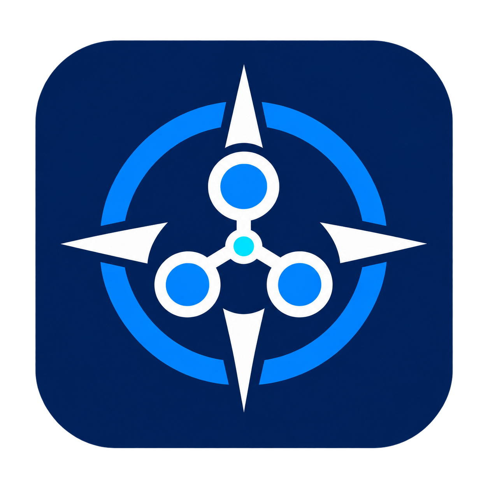

<div align="center">
  
  <h1>Talos Pilot</h1>
  <p>A local desktop cockpit for Talos Linux and Kubernetes.</p>

<a href="https://github.com/agiledevel/talos-pilot/blob/main/package.json"></a>
<a href="https://github.com/agiledevel/talos-pilot/actions/workflows/check.yml"></a>
<a href="https://github.com/agiledevel/talos-pilot/actions/workflows/sonar.yml"></a>
<a href="https://github.com/agiledevel/talos-pilot/actions/workflows/release.yml"></a>
</div>

Talos Pilot is being built to bring cluster infrastructure and Kubernetes workloads into one desktop application. The planned v1 covers creating clusters on machines in Talos maintenance mode, inspecting nodes and workloads, managing resources and Helm releases, performing guided upgrades, and backing up and recovering clusters.

**Current stage: foundation development, milestone 1.** The application currently provides a runnable Tauri shell with light/dark themes, compact density, and an empty cluster view. Cluster connections, credential storage, and management operations are not implemented yet. Preview packages demonstrate the shell and packaging; the complete v1 scope remains the [locked design](docs/design.md).

The [milestone 1 FLASH LLM implementation plan](docs/plans/milestone-1-flash.md) defines the remaining foundation work in small execution packets, with context, checkpoints, required tests, and evidence for a fast implementing model.

## What Talos Pilot is building

- **Talos lifecycle:** maintenance onboarding, upstream configuration generation and validation, bootstrap, node management, upgrades, diagnostics, backup, and recovery.
- **Kubernetes management:** workloads, networking, storage, access policies, custom resources, logs, container terminals, port forwarding, metrics, and Helm.
- **Guided operations:** explicit target review, preflight checks, progress, per-target results, and interruption/recovery handling.
- **Local credentials:** backend-owned API clients and encrypted storage, direct access over your LAN or existing VPN, and no hosted control service.

These are product commitments under development. Their acceptance criteria and milestone order are in the [design](docs/design.md) and [quality standards](docs/quality.md).

## Architecture

| Layer               | Technology and responsibility                                                                                                              |
| ------------------- | ------------------------------------------------------------------------------------------------------------------------------------------ |
| Desktop and backend | Tauri 2, Rust, Tokio; native application services and ordinary Kubernetes access                                                           |
| Interface           | React, strict TypeScript, Ant Design; bounded application projections through typed IPC                                                    |
| Talos and Helm      | A bundled Go helper using official upstream APIs and SDKs, introduced during foundation work                                               |
| Development         | Vite 8, pnpm, Oxlint with type diagnostics, Oxfmt                                                                                          |
| Verification        | Renderer tests, browser accessibility flows, native/platform checks, and disposable cluster fixtures as their capabilities are implemented |

The renderer does not own cluster credentials or connect directly to cluster APIs. The [dependency research](docs/dependencies.md) records exact versions and primary sources; package and Cargo lockfiles are committed.

## Run from source

Install **Node 26.11.1**, **pnpm 12.10.1**, **Rust 1.99.0**, and the [Tauri native prerequisites](https://v2.tauri.app/start/prerequisites/) for your OS. Node and Rust are pinned in `.node-version` and `rust-toolchain.toml`.

```sh
git clone https://github.com/agiledevel/talos-pilot.git
cd talos-pilot
npm install --global pnpm@12.10.1
pnpm install --frozen-lockfile
pnpm desktop:dev
```

Use `pnpm dev` for the browser shell at `http://127.0.0.1:1420`. Appearance preferences last for the current session. Native builds target Linux x86_64, macOS Apple Silicon/Intel, and Windows x86_64; configured CI targets are distinct from verified operating-system compatibility.

## Quality checks

```sh
pnpm check                         # format, lint/types, unit tests, frontend build
pnpm test:coverage                 # coverage reports, including LCOV
pnpm exec playwright install chromium
pnpm test:e2e                      # browser appearance and accessibility
pnpm icons:check                   # deterministic desktop icon conversion
pnpm desktop:build                 # native release executable
```

[GitHub Actions](.github/workflows/check.yml) runs renderer checks and Rust formatting, Clippy, tests, rustdoc, builds, and dependency scans across the desktop build matrix. The [SonarCloud gate](.github/workflows/sonar.yml) requires the installed GitHub App's latest successful analysis on the exact commit. It rejects missing, stale, skipped, and failed results. Badges above report live checks; they are not a claim that every planned feature is qualified.

See the [initialization evidence](docs/verification/initialization.md) and [automation evidence](docs/verification/automation.md) for executed environments and limitations. The existing GLib/macro dependency advisory findings remain tracked foundation work. SonarCloud's automatic analysis currently does not support Rust or imported coverage; Rust has its own enforced checks. [SonarSource's documented limits](https://docs.sonarsource.com/sonarqube-cloud/analyzing-source-code/automatic-analysis/).

## Preview releases

The [release workflow](.github/workflows/release.yml) starts when a version tag is pushed or when an existing tag is selected through **Actions → Release preview → Run workflow**. It validates matching npm/Tauri/Cargo versions and main-branch ancestry, runs QA and the exact-commit SonarCloud gate, builds packages for all four desktop targets, generates Angular-commit release notes, and creates a **draft prerelease** with SHA-256 asset hashes.

Linux assets are AppImage, DEB, and RPM; macOS assets are separate Apple Silicon and Intel DMGs; Windows uses an NSIS installer. Current previews are development packages without production signing/notarization. Full production releases require the complete release qualification in [quality.md](docs/quality.md).

Read [CI and release setup](docs/ci-release.md) for repository settings, release commands, and failure recovery. The [changelog](CHANGELOG.md) is generated with the committed `cliff.toml` configuration.

## Contributing

Follow [AGENTS.md](AGENTS.md), the [quality standards](docs/quality.md), and the relevant development skills under [.agents/skills](.agents/skills). Use Angular semantic commits, such as `feat(clusters): add connection validation` or `fix(talos): preserve target identity`. Keep architecture decisions, tests, and documentation together with the behavior they explain.
