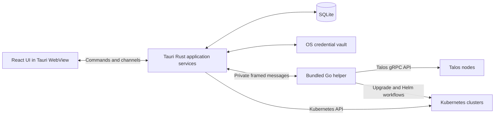

# Talos Pilot — Product and Technical Design

- Date: 2026-10-08
- Status: Locked implementation baseline v1, following the owner's instruction to lock the design.
- Product name: Talos Pilot.
- Development model: A solo project directed by the owner and developed with LLM assistance. No release deadline.

## 1. Product direction and agreed decisions

Talos Pilot is a desktop application for operating Talos Linux clusters and managing their Kubernetes workloads in one place. An operator can create a cluster on prepared machines, inspect both infrastructure and workloads, make changes, upgrade, back up, recover, and retire nodes through guided workflows.

| Decision | Selection | Status |
| --- | --- | --- |
| Desktop platforms | Linux, macOS, and Windows | Locked |
| Application framework | Tauri for the backend host, desktop integration, and WebView rendering | Locked |
| Frontend | React and TypeScript | Locked |
| Frontend development tools | Oxc stack, including Oxlint and Oxfmt | Locked |
| Component framework | Ant Design | Locked |
| Talos integration | Rust backend supervising a bundled Go helper that uses Talos APIs and upstream libraries | Locked |
| First release scope | Full Talos lifecycle and a complete Kubernetes management UI | Locked |
| Provisioning boundary | Configure machines already booted into Talos maintenance mode | Locked |
| Connectivity | Direct connections over LAN or an existing VPN | Locked |
| Visual direction | Clean interface that feels native, with guided workflows | Locked |
| Talos version | Latest Talos 1.14 patch release | Locked |
| AI, MCP, third-party extensions | Follow the first release | Locked |
| Development baseline | Kubernetes 1.36; core compatibility tests on 1.35–1.37 | Locked |
| Deployment model | Local application, using the operator's cluster credentials | Locked |

“First release” means the completed v1 feature set in section 5. Earlier milestones produce internal previews; they do not reduce the agreed release scope.

The stack in section 3, feature scope in section 5, guidelines in section 7, milestone order and initial platform targets in section 9 are settled design choices. [AGENTS.md](../AGENTS.md) mandates the development rules, [quality standards](quality.md) define completion and release gates, and the repository's four development skills supply implementation guidance. Exact compatible dependency pins and measured performance budgets are foundation work within this baseline.

## 2. Research and feature references

The references inform product behavior and architecture. This document defines a new implementation.

| Reference | Findings | Application to Talos Pilot |
| --- | --- | --- |
| [Talos Dashboard](https://github.com/erelbi/talos-dashboard) | Cluster profiles, machine configuration, reusable patches, bootstrap, node actions, upgrades, and live output. Its backend wraps `talosctl`. | Use these workflows as the Talos feature baseline; connect through APIs in the bundled helper. |
| [Talos documentation](https://docs.siderolabs.com/talos) | API-managed operating system, version-specific configuration, resources, maintenance access, and recovery procedures. | Use upstream clients, generators, validation, and lifecycle behavior as the authority. |
| [Freelens](https://github.com/freelensapp/freelens) and its [resource views](https://github.com/freelensapp/freelens/tree/main/packages/core/src/renderer/components) | Broad views for workloads, networking, storage, policy, access, CRDs, charts, and releases. Its desktop architecture uses Electron. | Reference for Kubernetes coverage and navigation; implement the desktop shell with Tauri. |
| [Kubeli](https://github.com/atilladeniz/Kubeli) and its [Rust dependencies](https://github.com/atilladeniz/Kubeli/blob/main/src-tauri/Cargo.toml) | Tauri/React application with a Rust Kubernetes client, logs, container terminals, port forwarding, metrics, YAML editing, and Helm views. | Reference for the Tauri integration and common Kubernetes interaction patterns. |
| [Tauri](https://github.com/tauri-apps/tauri) and its [architecture](https://v2.tauri.app/concept/architecture/) | Rust application host with HTML rendered by the system WebView, IPC, and native desktop integration. | Own the application process, windows, persistence, security boundary, and rendering host. |

Research snapshots: Talos Dashboard `ba8d142c0ca41dab062763881429723b6ee3cbe9`; Freelens `7cc9e2e9a2d3ac1c53a9a853c6dee0e269781917`; Kubeli `444659b201c54d364061d82efa76aa9f4e03e810`. Talos API research uses the released [v1.14.2 tag](https://github.com/siderolabs/talos/releases/tag/v1.14.2), published September 29, 2026. Feature directories indicate implementation coverage, not a guarantee that every upstream feature is production-ready.

### Version policy

Use **Talos 1.14**, initially pinning the helper's upstream modules to **1.14.2**. Refresh the patch pin before implementation and releases. Talos 1.14 lists Kubernetes **1.33–1.37** as compatible. This OS compatibility range is distinct from Kubernetes community maintenance. [Talos support matrix](https://docs.siderolabs.com/talos/v1.14/getting-started/support-matrix).

Use **Kubernetes 1.36** for the primary development cluster. This is a practical mainstream baseline: it is in EKS standard support and is IBM Cloud's default, while 1.35 remains available in both providers. This is an inference from provider availability and defaults; current representative deployment percentages by minor version were not found. [EKS versions](https://docs.aws.amazon.com/eks/latest/userguide/kubernetes-versions.html), [IBM Cloud versions](https://cloud.ibm.com/docs/containers?topic=containers-cs_versions).

| Version | Application commitment at this research snapshot |
| --- | --- |
| Talos 1.14.x | Full lifecycle support; verify the latest patch |
| Kubernetes 1.35, 1.36, 1.37 | Core supported matrix for the complete management UI |
| Kubernetes 1.34 | Legacy compatibility and upgrade tests; upstream maintenance ends October 27, 2026 |
| Kubernetes 1.33 | Legacy resource access and migration tests; upstream support has ended |
| Older Talos/Kubernetes | Detect version and explain compatibility limits; no untested lifecycle promises |

Upstream's current maintained release branches are 1.35–1.37. Existing clusters retain their chosen version; the creation wizard recommends the latest tested patch of the current release and offers the tested mainstream baseline. Compatibility fixtures move forward as upstream versions change. [Kubernetes releases](https://kubernetes.io/releases/).

## 3. Tech stack and architecture

### Stack

| Layer | Technology | Reason |
| --- | --- | --- |
| Desktop host and application backend | Tauri 2, Rust, Tokio | Native integration and asynchronous application services |
| Rendering | Tauri's native WebView with bundled frontend assets | Uses the requested desktop framework |
| Frontend | React, strict TypeScript, Vite 8, pnpm | Static frontend build with Oxc transforms and Rolldown bundling |
| Frontend quality tools | Oxlint, `oxlint-tsgolint`, Oxfmt | Oxc linting, type-aware diagnostics, type checking, and formatting |
| UI foundation | Ant Design (`antd`), `@ant-design/icons` | Shared components for tables, forms, navigation, and guided operations |
| Styling and theme | Ant Design tokens and ConfigProvider; CSS Modules for custom layout | Consistent light/dark themes, density, and application-specific styling |
| Routing | React Router in hash mode | Internal navigation in a packaged static application |
| Data projections | TanStack Query | Query status and cache updates from backend subscriptions |
| UI state | Zustand | Tabs, filters, selections, and panel layout; cluster state stays in the backend |
| YAML and diff editing | Monaco Editor with YAML language support | Shared editor for machine configuration and Kubernetes resources |
| Container terminals | xterm.js | Interactive container terminal rendering |
| Charts | uPlot | Resource usage trends with bounded time-series data |
| Kubernetes adapter | `kube-rs`, `k8s-openapi`, dynamic API discovery | Rust API access, watches, exec, and port forwarding |
| Talos adapter | Bundled Go helper; official Talos client, COSI runtime, configuration packages | Preserve upstream API and configuration semantics |
| Complex Go workflows | Talos Kubernetes upgrade libraries and Helm Go SDK | Reuse upstream orchestration and release logic |
| Persistence | SQLite through `rusqlite`, with migrations | Local profiles, preferences, and operation records |
| Secret storage | OS credential vault for the encryption key; authenticated encryption for sensitive stored data | Keep credentials and full configurations out of plain database rows |
| Contracts | Serde DTOs with generated TypeScript types; Protobuf for Rust/helper messages | Keep IPC types explicit across languages |
| Verification | Rust and Go tests, Vitest/React Testing Library, Playwright, WebdriverIO Tauri service | Exercise logic, renderer flows, native integration, and real clusters |

Pin compatible package versions and toolchains during the foundation milestone. Commit Cargo, Go, and pnpm lock data. Verify TypeScript compatibility with the selected Oxlint type-aware engine, which currently requires TypeScript 7+. Use Vite 8 with `@vitejs/plugin-react` v6 for Oxc-based TypeScript/JSX and React Refresh transforms. Exact package pins are established during implementation. [Oxlint type-aware requirements](https://oxc.rs/docs/guide/usage/linter/type-aware.html), [Vite 8 React integration](https://vite.dev/blog/announcing-vite8).

Primary technology references: [React](https://react.dev/), [Vite](https://vite.dev/guide/), [Oxc](https://oxc.rs/), [Oxlint](https://oxc.rs/docs/guide/usage/linter.html), [Oxfmt](https://oxc.rs/docs/guide/usage/formatter.html), [Ant Design](https://ant.design/), [TanStack Query](https://tanstack.com/query/latest/docs/framework/react/overview), [Monaco](https://microsoft.github.io/monaco-editor/), [xterm.js](https://xtermjs.org/), [kube-rs](https://docs.rs/kube/latest/kube/), [Helm SDK](https://helm.sh/docs/sdk/).

### Runtime boundaries



Rust owns profiles, credential access, operation plans, concurrency, job history, subscription lifetimes, and native file dialogs. The WebView sends typed requests to Rust and receives bounded projections and progress streams. It does not hold cluster client credentials or make direct cluster API requests.

The Go helper handles Talos networking, configuration generation and validation, patches, lifecycle RPCs, recovery primitives, Kubernetes upgrade orchestration, and Helm SDK calls. The ordinary Kubernetes browser uses the Rust adapter. The helper's Kubernetes clients are restricted to its workflows; they do not maintain a second browser cache. Rust refreshes affected resources after helper operations.

This arrangement retains a Tauri application backend while reusing the Go behavior that upstream provides. Kubernetes upgrades are a coordinated procedure rather than a single Talos RPC. [Upstream upgrade command](https://github.com/siderolabs/talos/blob/v1.14.2/cmd/talosctl/cmd/talos/upgrade-k8s.go), [configuration generator](https://github.com/siderolabs/talos/blob/v1.14.2/cmd/talosctl/cmd/mgmt/gen/config.go).

### Helper contract

Ship a helper binary for each application target using Tauri's external-binary packaging. Rust launches only the packaged binary, using private stdin/stdout pipes and no shell. The application needs no installed `talosctl`, `kubectl`, Helm executable, Go runtime, or server daemon for its built-in workflows. [Tauri sidecars](https://v2.tauri.app/develop/sidecar/).

Use a versioned, length-framed Protobuf protocol. Messages include request ID, session ID, operation ID, type, and sequence number. Support responses, progress, binary chunks, cancellation, and structured errors. Large snapshots travel in bounded chunks; diagnostic text goes to stderr and is redacted. Credentials travel through private pipes, never process arguments or environment variables. A startup handshake rejects incompatible helper versions.

The helper exits with its parent. If it fails during a mutation, Rust records an interrupted operation and reconciles node state before offering continuation. An automatic helper restart may restore reads; it must not replay an uncertain mutation.

Use Tauri commands for requests and channels for ordered logs, watches, terminal data, and progress. Small global events may announce application state changes. Apply batching, cancellation, and bounded buffers in application code. [Tauri commands](https://v2.tauri.app/develop/calling-rust/), [Tauri channels](https://v2.tauri.app/develop/calling-frontend/).

### Connections, discovery, and storage

Talos profiles import selected `talosconfig` contexts or accept a CA, client certificate, key, and endpoint list. Distinguish Talos API endpoints from target nodes and the Kubernetes API endpoint. Use endpoint failover and per-node routing through the official client. Discover members through Talos resources where available; allow explicit targets when discovery is unavailable. [talosconfig](https://docs.siderolabs.com/talos/v1.14/reference/talosconfig), [Talos client routing](https://github.com/siderolabs/talos/blob/v1.14.2/pkg/machinery/client/context.go).

Link a Kubernetes context by importing a kubeconfig or retrieving one through an authorized Talos connection. Keep Talos access and Kubernetes access separate: either can remain usable when the other fails. Also allow kubeconfig-only profiles, with Talos features unavailable until linked. Inspect kubeconfig exec authentication before allowing an external credential provider to run; require explicit trust for the executable and arguments. Imported contexts do not silently overwrite the user's original files.

Backend Kubernetes watches use resource versions, pagination, relisting after expired versions, reconnection, and cancellation. Subscribe only to active views and lightweight cluster summaries; namespace permissions and selectors constrain access. Talos resource subscriptions use upstream COSI types and sensitivity metadata. [Kubernetes API concepts](https://kubernetes.io/docs/reference/using-api/api-concepts/), [Talos resources](https://docs.siderolabs.com/talos/v1.14/learn-more/controllers-resources).

SQLite stores profile metadata, credential references, preferences, patch metadata, operation plans, per-target results, and redacted history. Encrypt credential blobs, full configuration drafts, cluster secrets, and secret-bearing patches. Store encrypted snapshot files separately. Do not persist Kubernetes Secret values, terminal output, or full logs by default. Vault failure permits session-only access or an explicit encrypted-file fallback; never silently save plaintext credentials.

Initial source layout:

```text
docs/                       design, decisions, roadmap, verification records
src/                        React application
  features/                 clusters, talos, kubernetes, helm, operations
  components/               shared UI, editors, terminal, tables
  lib/                      typed IPC, UI state, formatting
src-tauri/src/              commands and Rust application services
  talos/                    helper supervision and adapter
  kubernetes/               client sessions, discovery, watches, exec
  operations/               plans, locks, reconciliation, history
  storage/                  database, vault, encryption, exports
helper/                     Go Talos and Helm adapter
proto/                      private helper protocol
tests/                      integration scenarios and synthetic fixtures
```

## 4. Frontend technology and interaction model

Use a bundled React SPA. Lazy-load editors, terminals, charts, and specialized resource views. Keep protocol buffers, SDK objects, and raw API errors behind adapter boundaries. Export stable application DTOs for the UI.

### Oxc development workflow

Use Oxlint as the frontend linter with correctness, React/Hooks, TypeScript, import, accessibility, and test rules. Install the matching `oxlint-tsgolint` package for type-aware checks. The lint command also enables type-check diagnostics; Vite's Oxc transformation performs transpilation rather than type checking. Use Oxfmt for source and supported configuration/document formatting. Commit tool configuration and keep generated files and build outputs out of formatting/lint scopes. [Oxlint](https://oxc.rs/docs/guide/usage/linter.html), [type-aware checks](https://oxc.rs/docs/guide/usage/linter/type-aware.html), [Vite TypeScript handling](https://vite.dev/guide/features.html), [Oxfmt](https://oxc.rs/docs/guide/usage/formatter.html).

Planned package scripts:

| Script | Command or responsibility |
| --- | --- |
| `dev` | `vite` |
| `build` | `vite build` |
| `lint` | `oxlint --type-aware --type-check --deny-warnings` |
| `lint:fix` | `oxlint --type-aware --fix` |
| `format` | `oxfmt` |
| `format:check` | `oxfmt --check` |
| `format:rust` | `cargo fmt` over the Tauri crate, using `src-tauri/rustfmt.toml` |
| `format:rust:check` | `cargo fmt --check` over the Tauri crate |
| `test:run` | Vitest and React Testing Library in non-watch mode |
| `test:e2e` | Playwright renderer flows with the explicit mock transport |
| `test:native` | WebdriverIO with the Tauri service against an actual test build |
| `contracts:check` | Deterministic regeneration and comparison of DTO/Protobuf artifacts |
| `check` | Formatting check, lint/type diagnostics, renderer tests, and frontend build |

Configure the same checks for local development and CI from milestone 1. Verify the pinned tools against React, Ant Design, Monaco workers, and the generated IPC types before accepting the foundation milestone.

### Ant Design component foundation

Wrap the application in Ant Design's `ConfigProvider` and `App` providers. Use `Layout`, `Menu`, `Tabs`, and `Breadcrumb` for the shell; `Table` for resource lists; `Form`, `Steps`, and `Descriptions` for guided operations and details; and `Drawer`, `Modal`, `Alert`, and `Result` for contextual feedback. Use virtual tables and backend pagination for large lists. Keep Monaco, xterm.js, and uPlot as specialized editor, terminal, and chart components. [Ant Design with Vite](https://ant.design/docs/react/use-with-vite/), [Table](https://ant.design/components/table/).

Centralize light/dark algorithms, typography, spacing, radii, color, and density in theme tokens. Use component tokens and CSS Modules for custom layout. Context-aware messages and modals inherit the active theme. Verify dynamic styles and ConfigProvider's CSP support in packaged Tauri builds. [Theme customization](https://ant.design/docs/react/customize-theme/), [ConfigProvider](https://ant.design/components/config-provider/).

Provide three reusable page patterns: a searchable resource list; a detail view with summary, conditions, events, YAML, and related resources; and a guided operation with targets, preflight, preview, execution, and results. Reuse these patterns for built-in resources and discovered custom resources.

The shell consists of a cluster switcher, navigation sidebar, current context/namespace header, main content, and a collapsible activity panel. Cluster names and namespace scope remain visible in editors, terminals, and operation reviews. Work tabs remember their cluster; changing the global selection does not silently retarget an open tab.

Navigation groups:

| Area | Pages |
| --- | --- |
| Home | Saved clusters, connection state, recent operations |
| Overview | Kubernetes health, Talos health, nodes, resource usage, important events |
| Talos | Nodes, services, configuration, patch templates, logs, resources, lifecycle |
| Workloads | Pods, Deployments, StatefulSets, DaemonSets, ReplicaSets, Jobs, CronJobs |
| Network | Services, endpoints, Ingress, Gateway API resources, NetworkPolicies, forwards |
| Storage | PVCs, PVs, StorageClasses, available CSI and snapshot resources |
| Configuration and access | Namespaces, ConfigMaps, Secrets, RBAC, quotas, limits, autoscaling, policy |
| Custom resources | CRDs and discovery-driven resource views |
| Helm | Repositories, charts, releases, values, history |
| Operations | Active jobs, results, backups, recovery workflows |
| Settings | Connections, credentials, appearance, retention, updates |

The UI shows what the server provides and what the current user can access. Missing CRDs or optional metrics services produce informative empty states. They do not cause the whole cluster view to fail.

## 5. Supported features

All rows below belong to the completed first release unless explicitly marked as subsequent work. Specialized workflows require verification on the declared version matrix.

### Talos lifecycle and diagnostics

| Capability | v1 behavior |
| --- | --- |
| Cluster profiles | Import contexts, test connections, rename/tag profiles, select endpoints, inspect certificate expiry, export credentials explicitly |
| Create cluster | Guided generation of cluster secrets and versioned per-node configs; inspect maintenance nodes and disks; apply; bootstrap one control-plane node; verify health |
| Add nodes | Configure maintenance-mode workers or control-plane nodes with the existing cluster identity and appropriate node-specific settings |
| Node inspection | Role, addresses, versions, stage, readiness, CPU, memory, disks, volumes, networking, extensions, services, and containers |
| Live diagnostics | Service logs, kernel logs, node events, process/resource inspection, filtering, search, and explicit export |
| Configuration | Guided forms for common settings and expert YAML; multi-document support; fetch, validate, diff, dry-run, apply, stage, and try with a countdown |
| Reusable patches | Named templates; Talos strategic merge and JSON Patch; role-based target filters; per-node preview and results |
| Node actions | Reboot, shutdown, service restart, Kubernetes cordon/drain/uncordon, and documented maintenance actions |
| Talos upgrade | Choose an installer image, review compatibility and extensions, stage or execute, sequence nodes, follow progress, and verify versions/readiness |
| Kubernetes upgrade | Version-aware plan using upstream orchestration; component order, image preparation, health checks, and progress |
| etcd operations | Member/status/alarm inspection, snapshot, and guided defragmentation; explicit member removal when appropriate |
| Backups | On-demand etcd snapshots, integrity metadata, configuration/secret bundles, portable encrypted export, and import |
| Recovery | Guided snapshot restore, replacement control-plane configuration, recovery bootstrap, and health verification |
| Remove or reset nodes | Drain and membership checks, explicit partition/device selection, graceful departure where possible, wipe preview, and completion tracking |
| Activity history | Plans, target lists, timestamps, redacted output, warnings, and observed per-target results |

Use Talos's strategic merge implementation rather than a generic YAML merge. JSON Patch follows upstream support, including its restrictions for multi-document configuration. Preserve unknown documents and fields when editing. [Configuration patches](https://docs.siderolabs.com/talos/v1.14/configure-your-talos-cluster/system-configuration/patching).

In Talos 1.14, applying configuration does not implicitly reboot a node. Offer immediate apply, staged apply, and try mode, then a separate reviewed reboot when needed. Retain staged drafts because reading the current configuration does not reveal pending staged changes. Confirm a try-mode change by applying the intended configuration within the supported timeout; show loss of contact and automatic-revert status honestly. [Configuration modes](https://docs.siderolabs.com/talos/v1.14/configure-your-talos-cluster/system-configuration/editing-machine-configuration).

Prefer the version's lifecycle service for install and upgrade; do not build around deprecated machine upgrade RPCs. A Talos image rollback is distinct from configuration recovery or Kubernetes downgrade. [Lifecycle API](https://github.com/siderolabs/talos/blob/v1.14.2/api/machine/lifecycle.proto), [machine API](https://github.com/siderolabs/talos/blob/v1.14.2/api/machine/machine.proto).

### Complete Kubernetes management UI

| Capability | v1 behavior |
| --- | --- |
| Contexts and namespaces | Multiple profiles, favorites, namespace filters, connection health, kubeconfig import, and access inspection |
| Resource browser | List/search/filter/sort built-in and discovered resources; details, conditions, owner references, events, and YAML |
| Resource editing | Create, apply, patch, diff, export, and delete; server validation and dry-run where available; conflict handling |
| Workload actions | Scale, rollout restart, deployment revision inspection/rollback, Job creation from CronJob, and CronJob suspend/resume |
| Pod logs | Current/previous container logs; timestamps, follow, multi-container selection, bounded buffers, filtering, and export |
| Pod terminals | Container selection, interactive exec, resize, stdin/stdout/stderr, exit state, and reconnect behavior |
| Port forwarding | Pods and service-to-pod selection; loopback binding, port-conflict feedback, active-forward list, and explicit stop |
| Nodes | Conditions, capacity/allocatable, pods, labels/taints, cordon, drain, uncordon, and links to matching Talos nodes |
| Networking | Services, EndpointSlices, Ingress, NetworkPolicies, and discovery-driven Gateway API views |
| Storage | PVCs, PVs, StorageClasses, attachments and CSI resources; snapshot views when the relevant APIs are installed |
| Configuration | ConfigMaps, Secrets with explicit reveal, namespaces, resource quotas, limits, and metadata editing |
| Policy and access | ServiceAccounts, Roles/ClusterRoles and bindings, PDBs, priority/runtime classes, webhooks, admission policy, and access checks |
| Autoscaling | HPA views/actions; VPA through discovered APIs when installed |
| Custom resources | CRD schemas, generic CRUD, scope-aware navigation, and custom columns from server definitions |
| Metrics | Node/pod CPU and memory through metrics-server; historical charts when a configured Prometheus source is available |
| Helm | Chart repositories and OCI sources; search, values/schema review, template preview, install, upgrade, rollback, uninstall, and release history |
| Related resources | Owner/dependent and workload/service/pod navigation, including a lightweight topology view |
| Bulk operations | Explicit selection, per-object plan/result, cancellation between targets, and clear partial completion |

The baseline covers resources exposed by the Kubernetes API; specialized forms augment the generic editor. Additional ecosystem resources are accessible through discovery without requiring a bespoke screen for every operator.

Use server-side apply with a dedicated field manager for managed manifests, preview conflicts, and never force ownership silently. Preserve resource version for editing live objects and offer reload/diff when another actor changes the resource. Re-check identity and UID before destructive actions. [Kubernetes API behavior](https://kubernetes.io/docs/reference/using-api/api-concepts/).

Pod terminals execute in containers. Talos administration uses Talos APIs. Metrics-server and Prometheus are optional cluster integrations; historical data is unavailable without a history source. Resource editing remains usable when metrics are absent. Existing GitOps-managed objects display ownership context so users understand that controllers can reconcile a manual change.

### Subsequent work

AI assistance, MCP access, third-party extensions, dedicated Argo CD/Flux dashboards, Omni authentication, corporate proxies, cloud/VM provisioning, unattended backup services, full CA rotation workflows, and specialized workload-data backup integrations follow v1. Existing Argo CD/Flux resources are still accessible through the v1 custom-resource browser.

v1's etcd backup protects Kubernetes control-plane state. Persistent volume contents require workload/storage-specific backups. Scheduled desktop backups, if later added, operate only while the application is running unless a separate service is designed.

## 6. Guided operations and safeguards

### Cluster creation

1. Enter cluster name, Talos/Kubernetes versions, Kubernetes endpoint, node roles, and network basics.
2. Inspect maintenance-mode node identity and select installation disks. Verify the console certificate fingerprint before sending secret-bearing configuration.
3. Generate one cluster secret bundle and per-node configurations using upstream libraries. Offer common forms and expert YAML; show validation and a reviewed install plan.
4. Save/export a recoverable encrypted secret/configuration bundle, then apply configurations to the selected machines.
5. Reconnect with mTLS, bootstrap exactly one selected control-plane node, and wait for etcd, Talos, Kubernetes, and nodes to reach expected states.
6. Offer Kubernetes access and a results page with per-node status and next actions.

Maintenance access is a separate, explicitly selected connection mode with a restricted operation set. Once configured, use authenticated access. An unverified fingerprint requires an explicit informed override; do not silently convert a failed authenticated connection into maintenance access. [Maintenance access and identity](https://docs.siderolabs.com/talos/v1.14/configure-your-talos-cluster/system-configuration/insecure).

### Upgrades and disruptive node actions

Create a plan from live versions, roles, etcd membership, health, selected targets, and workload disruption constraints. Upgrade Talos and Kubernetes as separate operations. Follow tested adjacent-minor paths and upstream orchestration. Control-plane changes run one at a time; worker concurrency is configurable and defaults to one. Expose existing Talos drain behavior rather than inadvertently performing it twice. Stop at a failed health checkpoint. [Talos upgrades](https://docs.siderolabs.com/talos/v1.14/configure-your-talos-cluster/lifecycle-management/upgrading-talos), [Kubernetes upgrades on Talos](https://docs.siderolabs.com/kubernetes-guides/advanced-guides/upgrading-kubernetes).

Respect PodDisruptionBudgets and show blocking workloads. Force eviction, local-data deletion, and ungraceful reset require deliberate choices. Uncordon only after the expected checks, and restore only cordon state that the operation itself changed. [Safe node draining](https://kubernetes.io/docs/tasks/administer-cluster/safely-drain-node/).

### Recovery

Inspect reachable etcd members and distinguish restorable quorum from a required snapshot restore. Select an intact snapshot and matching cluster secret/configuration material; display age, integrity information, targets, and destructive preparation. Keep healthy-cluster operations separate from an explicit disaster-recovery mode. Prepare the control plane according to the installed Talos version's storage layout, upload the snapshot, recovery-bootstrap one node, and verify the remaining members and Kubernetes. Do not generalize a fixed partition-wipe recipe to every layout. [Disaster recovery procedure](https://docs.siderolabs.com/talos/v1.14/build-and-extend-talos/cluster-operations-and-maintenance/disaster-recovery).

### Operation state

Use `draft → validating → awaiting review → running → verifying → succeeded`, with `failed`, `cancelled`, and `interrupted` outcomes. Track per-target states and keep an operation lock for conflicting mutations. Revalidate a plan before execution if targets, configurations, versions, or health changed.

Persist the plan and checkpoints before mutations. Retry transient reads with backoff. Do not blindly retry bootstrap, wipe, restore, release installation, or another mutation after an uncertain response. Reconcile observed state first. Cancellation stops the next safe step; it cannot undo an accepted reboot or API mutation. Quitting during an operation shows the active steps and expected interruption behavior.

## 7. Design guidelines

### Appearance

Use system font stacks, familiar desktop controls, native window decorations, restrained surfaces, and a single blue accent. Support system, light, and dark themes. Bundle all assets and avoid remote fonts or UI dependencies at runtime. Use an 8-pixel spacing rhythm, approximately 14-pixel body text, 6–8-pixel control radii, and 40-pixel default table rows. Provide a compact density option.

Apply these guidelines through Ant Design theme and component tokens, including default, dark, and compact algorithms where appropriate. Share tokens with editor and chart themes so the application feels consistent. Verify keyboard interaction, focus, and screen-reader behavior in the assembled workflows.

Charts support an operational question. Overview cards summarize health; tables and details support investigation. Avoid decorative animation, heavy gradients, and excessive transparency. Short transitions respect reduced-motion preferences. Target a comfortable 1280×800 workspace, adapt down to 1024×700, and support scaling and high-DPI screens.

### Behavior and accessibility

| Guideline | Application |
| --- | --- |
| Persistent context | Cluster, environment label, namespace, and exact targets remain visible |
| Guided by default | Creation, upgrades, reset, and recovery have steps; expert YAML stays available |
| Progressive disclosure | Common inputs first; advanced fields and raw resources on demand |
| Honest status | Distinguish connecting, healthy, degraded, unavailable, unauthorized, unsupported, and stale |
| Accessible feedback | Combine color with text/icons; keyboard navigation, visible focus, screen-reader labels, and sufficient contrast |
| Keyboard conventions | Cmd on macOS and Ctrl elsewhere; command palette, search, tab navigation, copy, and Escape |
| Clear errors | Explain the failed action, affected target, known cause, and available next step |
| Mutation review | Show a meaningful diff, targets, expected interruption, and per-target outcome |
| Destructive confirmation | Name the cluster/node/resource and wipe scope; require typed identity for reset/restore/bulk deletion |
| Secret handling | Redacted by default; reveal/copy/export are explicit and limited to the active view |
| Live data control | Pause, follow, search, clear, and export logs; stop unused subscriptions |
| Empty states | Explain absent permissions, optional APIs, or metrics dependencies and show a useful next action |

Production environment labels may strengthen context visibility and confirmations. They do not replace API authorization. Talos certificate roles and Kubernetes RBAC remain the authority. [Talos RBAC](https://docs.siderolabs.com/talos/v1.14/security/rbac).

## 8. Security and reliability boundaries

Use narrowly scoped Tauri commands and capabilities, a restrictive Content Security Policy, and bundled local content. Rust validates command inputs, cluster scope, target identity, file destinations, and operation state. Do not expose arbitrary process execution or broad filesystem APIs to the renderer. Capability configuration requires testing for custom commands as well as plugins. [Tauri capabilities](https://v2.tauri.app/security/capabilities/).

Normal Talos and Kubernetes sessions validate TLS. Credential expiry and authorization failures have separate UI states. Read-only identities can use available features without being prompted for administrative credentials. Permission checks guide the UI; server authorization is authoritative.

Client private keys remain in the backend/helper. Full machine YAML and Kubernetes secrets can reach the renderer only through explicit expert editing or reveal, and may then be held temporarily in memory. Avoid logging IPC payloads, storing these in browser storage, or persisting editor contents without encryption. Portable recovery exports use a standard encrypted format, independent of the original desktop vault; implementation must demonstrate import on a fresh machine.

Retain redacted local operation history, not an asserted tamper-proof cluster audit log. Default telemetry is off. Diagnostic export is explicit and previews its scope. Port forwards bind to loopback by default. Review and trust imported kubeconfig credential executables before running them.

Package and sign the helper with the application, provide dependency/license notices, and generate a dependency inventory. Use signed application updates when update hosting is configured. Development builds remain locally installable; production signing credentials are supplied by the owner at release time.

## 9. Development course

Build in vertical increments with a runnable result at each step. Each task records its purpose, contract/API change, acceptance criteria, and verification command. Keep durable decisions and handoff notes under `docs/` so a new LLM session can continue without reconstructing architecture. The owner reviews UX and consequential tradeoffs at milestone boundaries. Calendar estimates are unnecessary for this project.

| Milestone | Deliverable | Completion criteria |
| --- | --- | --- |
| 0. Design baseline — complete 2026-10-08 | Locked design, AGENTS.md, development skills, mandatory quality standards | Product scope, architecture, and v1 boundaries settled by the owner |
| 1. Feasibility and foundation | Tauri/React/Ant Design shell, Oxc development checks, packaged helper, typed IPC, secure storage, test harness | Launches on all three OSes; Oxlint/Oxfmt checks, Ant Design themes/CSP, helper handshake, mTLS Talos read/stream, Rust Kubernetes read/watch, editor workers, and vault behavior demonstrated |
| 2. Connections and read views | Context import/linking, overview, Talos nodes/services/logs, Kubernetes discovery/browser | Invalid credentials, partial permissions, unavailable nodes, and reconnects produce usable states |
| 3. Creation and configuration | Maintenance onboarding, generator, editor, patches, bootstrap/add-node workflows | Create a disposable cluster, join a node, preserve shared identity, apply/stage/try changes, and verify results |
| 4. Kubernetes management | Resource CRUD, workloads, network/storage/access views, logs, exec, forwarding | Complete namespace-scoped operator workflow; editor conflicts, stream lifetimes, RBAC, and port cleanup verified |
| 5. Safe lifecycle operations | Plan engine, Talos/Kubernetes upgrade, drain, node removal/reset, etcd maintenance | Sequential control-plane actions, disruption checks, partial failures, cancellation, and restart reconciliation verified |
| 6. Backup and recovery | Encrypted snapshots/config bundles and recovery wizard | Restore a deliberately broken disposable control plane and import a recovery bundle on a fresh desktop profile |
| 7. Kubernetes completeness | Helm lifecycle, metrics integration, CRDs/custom columns, relationships/topology, bulk actions | Every Kubernetes feature row in section 5 has a verified path or an explicit missing-cluster-dependency state |
| 8. Release preparation | Installers, documentation, accessibility/performance checks, signing/update preparation | v1 matrix passes; every Talos feature row is verified; installers and bundled helper work on clean target systems |

Implement the shared operation plan/journal primitives before the first mutation in milestone 3, then expand the engine in milestone 5. Implement basic CRD discovery in milestone 2; milestone 7 adds richer views. Platform builds run from milestone 1 onward so packaging issues surface early.

### Verification strategy

The requirements in [quality.md](quality.md) are mandatory. Milestone completion requires recorded evidence for every applicable gate; a missing harness or unexecuted check remains unfinished work. Documentation-only changes use the documentation checks rather than application tests that do not yet exist.

Frontend changes pass Oxfmt formatting checks and Oxlint lint/type diagnostics before renderer tests and builds. Keep the command definitions and tool versions consistent between local development and CI.

Rust tests cover application boundaries, operation conflicts, storage/migrations, and interrupted-operation reconciliation. Go tests cover helper protocol behavior, configuration generation/validation, patch semantics, and upstream workflow adaptation. Use recorded synthetic fixtures for API-version differences without cluster secrets.

Renderer tests cover target selection, diffs, permission states, and destructive reviews. Playwright exercises the UI with a mock transport. Native WebdriverIO tests exercise actual Tauri IPC, file dialogs where automatable, helper packaging, and stream cleanup. Tauri now documents an embedded WebDriver route for Linux, macOS, and Windows; include it only in test builds. [Tauri WebDriver testing](https://v2.tauri.app/develop/tests/webdriver/).

Real integration tests use disposable Talos clusters, including a three-control-plane topology for quorum, upgrades, reset, and recovery. A Kubernetes-only local cluster can accelerate browser tests but cannot validate Talos lifecycle behavior. Mutation tests run only against identified disposable fixtures, never the owner's existing clusters implicitly.

Core Kubernetes tests cover 1.35, 1.36, and 1.37. Legacy tests cover 1.33/1.34 browsing and sequential migration. Include restricted identities, absent metrics/CRDs, watch expiration, network loss, certificate failure, helper failure, interrupted operations, terminal termination, and port-forward cleanup. Pin test images and refresh patches deliberately.

Initial performance fixture: 20 saved profiles, 3 active clusters, 100 nodes in one cluster, and 10,000 discovered Kubernetes objects. Use paginated queries, virtualized tables, subscription limits, and bounded logs. Measure startup, interaction latency, idle CPU, memory, and long-running stream growth on declared hardware; set release thresholds from the first measured baseline. These fixture sizes are targets for verification, not claimed hard limits or measured performance.

### Initial packaging targets

| Platform | Initial targets and packages |
| --- | --- |
| Linux | x86_64; Ubuntu 22.04+ reference build and a current Fedora test; AppImage, DEB, RPM; document WebKitGTK/runtime requirements |
| macOS | Apple Silicon and Intel; macOS 13+ baseline; app/DMG with production signing and notarization |
| Windows | x86_64; Windows 11 reference test with Windows 10 compatibility subject to verification; NSIS installer and WebView2 setup |

Linux ARM64 and Windows ARM64 follow the initial targets. Windows 11 is the v1 release gate; Windows 10 compatibility is an investigation target until verified. The foundation and packaging milestones verify these OS targets and document runtime installation requirements. Any necessary change to a minimum OS target is recorded as a design change; listing an OS here does not imply verification has already occurred. [Tauri distribution](https://v2.tauri.app/distribute/).

## 10. Locked baseline and implementation readiness

The five requested areas are defined: tech stack (section 3), development course (section 9), frontend technology (section 4), supported features (section 5), and design guidelines (section 7).

The owner has locked the design, including the name, Kubernetes 1.36 development baseline with 1.35–1.37 core tests, local credential model, Rust Kubernetes adapter plus Go Talos/Helm workflows, initial platform targets, and milestone order. Milestone 0 is complete. Milestone 1 is the next development step.

Milestone 1 resolves exact compatible toolchain/library pins, cross-platform secret-vault support, Ant Design styles and Monaco workers under the packaged CSP, helper packaging/signing, and native test harness integration. Implement and verify these within the selected architecture. The full lifecycle remains a release requirement.

Routine implementation decisions, dependency patch updates, fixes, and verification proceed under this baseline. A material change to stack, architecture, release scope, security boundaries, or platform targets requires an owner-directed decision, with rationale and consequences recorded here or in a linked architecture decision record. Prepare concrete evidence and a proposed resolution when feasibility requires such a change; do not silently substitute technologies or shrink v1.

All contributors must follow [AGENTS.md](../AGENTS.md), the [quality standards](quality.md), and the relevant [Rust](../.agents/skills/talos-pilot-rust/SKILL.md), [React](../.agents/skills/talos-pilot-react/SKILL.md), [Tauri](../.agents/skills/talos-pilot-tauri/SKILL.md), and [TypeScript](../.agents/skills/talos-pilot-typescript/SKILL.md) skills.

This document is a researched design. No application implementation, live-cluster integration, performance result, or platform build has been validated yet.
